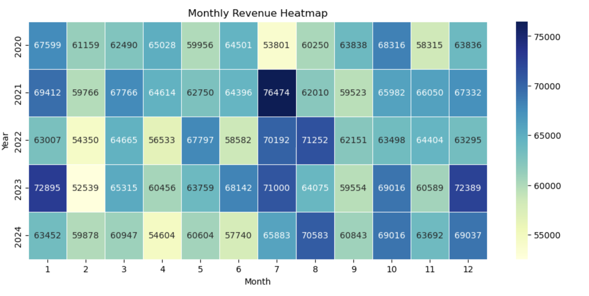
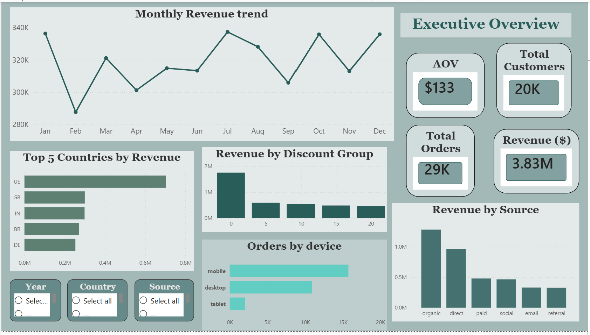
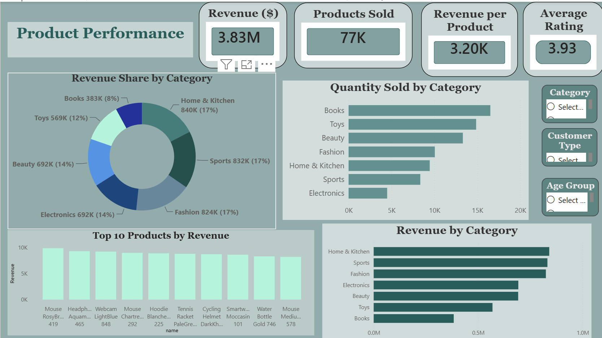
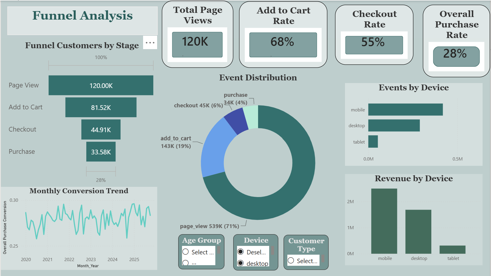
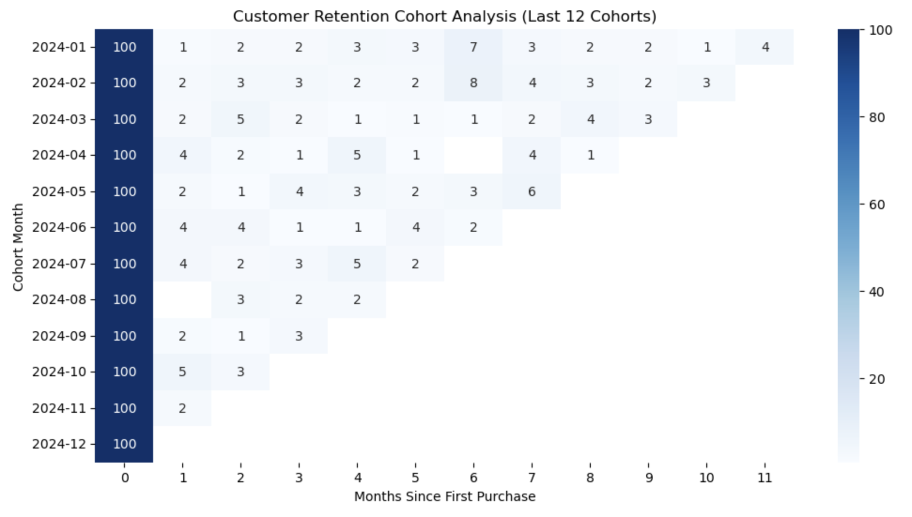

# E-Commerce Customer & Sales Analytics Project

## Project Overview

This project analyzes e-commerce customer behavior, sales performance, product profitability, marketing effectiveness, customer satisfaction, retention, and customer segmentation using SQL, Python, and data visualization techniques.

The objective was to identify key business drivers, understand customer purchasing patterns, evaluate marketing performance, and provide actionable recommendations to improve customer retention and revenue growth.

---
Project Visualizations и вставь изображения подряд.

# Project Visualizations

## Monthly Revenue Heatmap


## Sales Overview



## Product Performance



## Funnel Analysis




## Cohort Retention Analysis



---

## Business Questions

### Sales Analysis

* How has revenue changed over time?
* What are the monthly and yearly sales trends?
* What is the Average Order Value (AOV)?
* How many orders are placed each year?

### Customer Analysis

* How many customers completed at least one purchase?
* Which countries generate the highest revenue?
* What percentage of customers are repeat buyers?
* Who are the most valuable customers?

### Product Analysis

* Which product categories generate the highest revenue?
* Which products are the best-selling?
* Which products generate the highest profit?

### Marketing Analysis

* Which acquisition channels generate the most revenue?
* Which channels attract the most valuable customers?
* How does customer value vary by channel and device?

### Customer Satisfaction Analysis

* What is the average customer rating?
* Which categories receive the highest and lowest ratings?
* Does satisfaction differ across acquisition channels?

### Retention & Segmentation

* How effectively does the business retain customers?
* How do customer cohorts behave over time?
* Which customer segments generate the most revenue?
* Which customers are at risk of churn?

---

## Dataset

The project uses transactional e-commerce data containing:

* Orders
* Order Items
* Customers
* Products
* Website Sessions
* Customer Reviews

Analysis period: 2020–2024

---

## Data Cleaning & Preparation

* Removed duplicate records
* Standardized date formats
* Verified data consistency
* Created derived business metrics
* Prepared data for SQL and Python analysis

---

## Key Metrics Calculated

### Sales Metrics

* Total Revenue
* Monthly Revenue
* Yearly Revenue
* Number of Orders
* Average Order Value (AOV)
* Profit Margin

### Customer Metrics

* Unique Customers
* Repeat Customer Rate
* Revenue per Customer
* Customer Lifetime Revenue

### Marketing Metrics

* Revenue by Channel
* Customers by Channel
* Revenue per Customer by Channel

### Customer Satisfaction Metrics

* Average Rating
* Rating Distribution
* Rating by Product Category
* Rating by Acquisition Source

### Retention Metrics

* Cohort Retention Rate
* Repeat Customer Rate

### RFM Metrics

* Recency
* Frequency
* Monetary Value
* Customer Segments

---

## Tools & Technologies

* SQL (MySQL)
* Python
* Pandas
* Matplotlib
* Seaborn
* Jupyter Notebook
* Git & GitHub

---

## Key Findings

### Sales Performance

* Annual revenue remained stable throughout the analyzed period.
* Average Order Value remained consistent across years.
* Revenue was primarily driven by order volume rather than increased customer spending.

### Customer Analysis

* More than 15,000 customers completed at least one purchase.
* The United States generated the highest revenue.
* Repeat customer rate reached 55.54%.

### Product Analysis

* Home & Kitchen generated the highest revenue.
* Books achieved the highest sales volume.
* Electronics generated high revenue despite lower sales volume.

### Marketing Analysis

* Organic traffic generated the highest revenue and customer value.
* Direct traffic also performed strongly.
* Email campaigns generated the lowest revenue per customer.

### Customer Satisfaction

* Average rating reached 3.93/5.
* More than 75% of reviews were rated 4 or 5 stars.
* Beauty products received the highest ratings.

### Retention Analysis

* Monthly retention remained relatively low after the acquisition month.
* Most customer churn occurred shortly after the first purchase.

### RFM Analysis

* At Risk Customers generated the largest share of revenue.
* Best Customers represented only a small percentage of customers but contributed substantial revenue.
* Customer retention presents the largest growth opportunity.

---


## Business Recommendations

* Improve customer retention through loyalty programs.
* Re-engage At Risk customers with targeted campaigns.
* Increase investment in high-performing acquisition channels.
* Investigate lower customer satisfaction within the Electronics category.
* Focus on increasing customer lifetime value through personalization and retention initiatives.

---

## Project Structure

```e_commerce_7tables_portfolio_project/
│
├── data/
├── notebooks/
├── sql/
├── powerbi/
├── reports/
├── images/
├── README.md
├── .gitignore
|__requirements.txt
```

---

## Conclusion

The analysis revealed that the business maintains stable sales performance and strong customer acquisition. However, long-term growth opportunities lie in improving customer retention, increasing customer lifetime value, and strengthening relationships with high-value customer segments.
